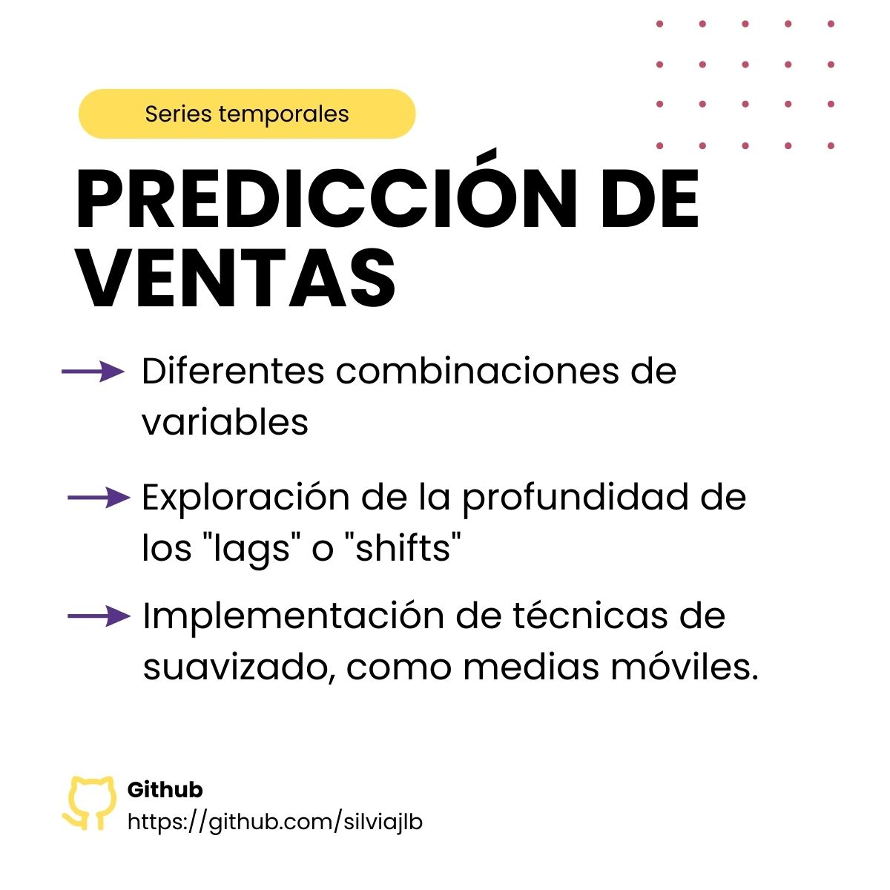

### Predicción de Ventas del Mes Siguiente mediante Series Temporales

#### Breve Descripción:
Este proyecto se enfocó en prever las ventas del próximo mes empleando técnicas de series temporales. Comenzando con un conjunto de datos limpio y preprocesado, nos enfrentamos al desafío de crear nuevas características con información limitada disponible.

#### Objetivos y Enfoque:
Optamos por utilizar el modelo XGBRegressor, evaluando su rendimiento mediante la métrica de error cuadrático medio (RMSE). Nuestro principal objetivo fue mejorar continuamente el modelo, explorando diversas estrategias, como:

- Experimentación con diferentes combinaciones de variables para capturar mejor la variabilidad en los datos.
- Exploración de la profundidad de los "lags" o "shifts" temporales para detectar patrones de comportamiento a lo largo del tiempo.
- Implementación de técnicas de suavizado, como medias móviles, para considerar tendencias y estacionalidades en los datos.

Además, investigamos otros algoritmos de modelado para comparar su desempeño con el XGBRegressor, que finalmente resultó ser el mejor modelo. Ajustamos finamente los hiperparámetros del modelo para optimizar su rendimiento y precisión en la predicción de las ventas futuras.

#### Resultados y Conclusiones:
Este proyecto proporcionó no solo una valiosa experiencia en el manejo de datos de series temporales, sino también la oportunidad de explorar y aplicar diversas estrategias de modelado para mejorar la precisión de las predicciones de ventas. 

